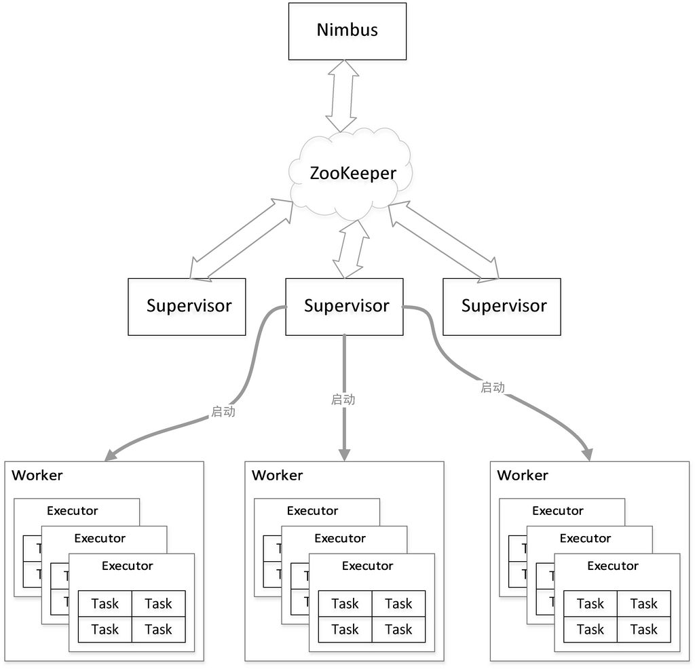
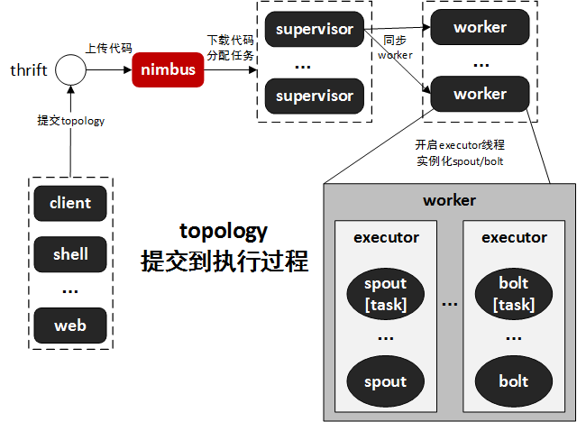

## 核心概念

- Topology
- Stream
- Spout
- Bolt
- Stream grouping

### Topology

Topology，就是Storm中运行实时应用。类似为MapReduce的Job。根本区别，MR Job执行完成就结束，而Topology会一直存在。因为MR流动的是代码，而Storm流动的是数据。

### Stream

The Stream is the core abstraction in Storm. A stream is an unbound sequence of tuples that is processed and created in parallel in a distributed fashion. Streams are defined with a schema that names the fields in the stream's tuples. By default, tuples can contain integers, longs, bytes, strings, doubles, floats, booleans, and byte arrays. You can also define your own serializers so that custom types can be used natively with tuples.

流，是Storm中核心抽象。一个流是在分布式环境下被并行创建和处理的无界元组（tuple）序列。一个Stream中的tuple都有固定的schema。默认情况，元组可以包含字符串型，数值型，字节，布尔型，及数组。简单点说，就是源源不断传递的tuple就组成了流。

Resources：

- [Tuple](http://storm.apache.org/releases/1.0.2/javadocs/org/apache/storm/tuple/Tuple.html): streams are composed of tuples
- [OutpuFieldstDeclared](http://storm.apache.org/releases/1.0.2/javadocs/org/apache/storm/topology/OutputFieldsDeclarer.html): used to declare streams and their schemas
- [Serialization](http://storm.apache.org/releases/1.0.2/Serialization.html): Infomation about storm's dynamic typing of tuples and declaring custom serializations.

### Tuple

Tuple是命名的value序列，可以理解成KV结构，每个value可以是任意类型。如果Tuple是动态类型，那么其字段类型是不需要事先声明的。

> 一次消息传递的基本单元。原本应该是有一个kv的map。但由于各个组件之间传递的tuple的字段名称已经事先定义好，所以tuple中只要按序填入各个value就行了，所以就是一个value序列。

Tuple在传输过程中需要序列化和反序列化，Storm集成了普通类型的序列化模块。而对于用户自定义特殊类型需要用户自己实现并注册对应的序列化器。

### Spout

Spout是Storm里面特有的名词，Stream的源头。其是在一个Topology中产生源数据流的组件。通常情况下Spout会从外部数据源中读取数据，然后转换到Topology内部的源数据。Spout是一个主动的角色，其内部有一个nextTuple()函数, Storm框架会不停地调用此函数，用户只要在其中生成源数据即可。

### Bolt

在一个topology中接受数据然后执行处理的组件。Bolt可以执行过滤、函数操作、合并、写数据库等任何操作。Bolt是一个被 动的角色，其接口中有个execute(Tuple input)函数,在接受到消息后会调用此函数，用户可以在其中执行自己想要的操作。

### Stream grouping

路由策略，一个tuple发往下游某个bolt n个并发中的哪个

- **Shuffle grouping**	，随机选择
- **Fields grouping**，按字段Hash
- **Partial Key grouping**：字段部分Hash
- **All grouping**：全部
- **Global grouping**：一个Task
- **None grouping**：不关心Task在Stream中如何做分发，目前等同于Shuffle grouping
- **Direct grouping**：产生数据的Spout/Bolt自己明确决定这个Tuple被Bolt的那些Task所消费
- **Local or shuffle grouping**：如果目标Bolt中的一个或者多个Task和当前产生数据的Task在同一个Worker进程里面，那么就走内部的线程间通信，将Tuple直接发给在当前Woker进程的目的Task。否则，同Shuffle	grouping

## Storm基本结构

| 概念         | 解释                                       |
| :--------- | :--------------------------------------- |
| Nimbus     | 负责资源分配和任务调度                              |
| Supervisor | 负责接收Nimbus分配的任务，启动和停止属于自己管理的Worker进程     |
| Worker     | 运行具体处理组件逻辑的进程                            |
| Executor   | 运行Spout或Bolt处理逻辑的线程                      |
| Task       | Storm中最小处理单元，一个Executor中可以包含一个或多个Task，消息的分发都是从一个Task到另一个Task进行的 |

 

### Topology提交及任务运行流程

1. 非本地模式下，客户端通过thrift调用nimbus接口，来上传代码到nimbus并触发提交操作.
2. nimbus进行任务分配，并将信息同步到zookeeper.
3. supervisor定期获取任务分配信息，如果topology代码缺失，会从nimbus下载代码，并根据任务分配信息，同步worker.
4. worker根据分配的tasks信息，启动多个executor线程，同时实例化spout、bolt、acker等组件，此时，等待所有connections（worker和其它机器通讯的网络连接）启动完毕，此storm-cluster即进入工作状态。
5. 除非显示调用kill topology，否则spout、bolt等组件会一直运行。

 

