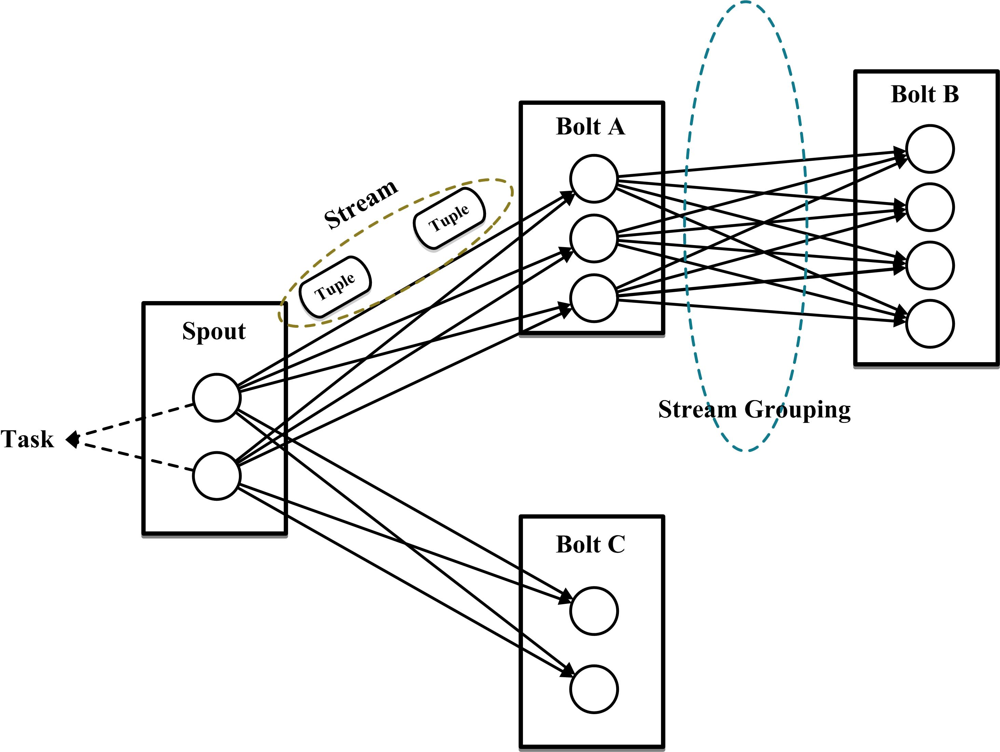

## 基本概念

- Topology
- Stream
- Spout
- Bolt
- Stream grouping
- Reliability
- Task
- Worker

### Topology

Topology，就是Storm中运行实时应用。类似为MapReduce的Job。根本区别，MR Job执行完成就结束，而Topology会一直存在。因为MR流动的是代码，而Storm流动的是数据。

### Stream

The Stream is the core abstraction in Storm. A stream is an unbound sequence of tuples that is processed and created in parallel in a distributed fashion. Streams are defined with a schema that names the fields in the stream's tuples. By default, tuples can contain integers, longs, bytes, strings, doubles, floats, booleans, and byte arrays. You can also define your own serializers so that custom types can be used natively with tuples.

流，是Storm中核心抽象。一个流是在分布式环境下被并行创建和处理的无界元组（tuple）序列。一个Stream中的tuple都有固定的schema。默认情况，元组可以包含字符串型，数值型，字节，布尔型，及数组。简单点说，就是源源不断传递的tuple就组成了流。

Resources：

- [Tuple](http://storm.apache.org/releases/1.0.2/javadocs/org/apache/storm/tuple/Tuple.html): streams are composed of tuples
- [OutpuFieldstDeclared](http://storm.apache.org/releases/1.0.2/javadocs/org/apache/storm/topology/OutputFieldsDeclarer.html): used to declare streams and their schemas
- [Serialization](http://storm.apache.org/releases/1.0.2/Serialization.html): Infomation about storm's dynamic typing of tuples and declaring custom serializations.

### Tuple

Tuple是命名的value序列，可以理解成KV结构，每个value可以是任意类型。如果Tuple是动态类型，那么其字段类型是不需要事先声明的。

> 一次消息传递的基本单元。原本应该是有一个kv的map。但由于各个组件之间传递的tuple的字段名称已经事先定义好，所以tuple中只要按序填入各个value就行了，所以就是一个value序列。

Tuple在传输过程中需要序列化和反序列化，Storm集成了普通类型的序列化模块。而对于用户自定义特殊类型需要用户自己实现并注册对应的序列化器。

