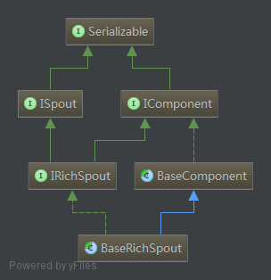

# Java API


- Spout
  - ISpout	// 最基本的Spout接口
  - IRichSpout    // 带有output定义、用的最多的接口
  - 核心是`nextTuple()`回调函数
- Bolt
  - IBolt	// 最基本的Bolt接口
  - IRichBolt    // 带output定义、用的最多的接口
  - IBasicBolt    // 针对常用场景简化的Bolt接口
- Base*
  - 实现对应接口的基类（具体实现为空）
  - BaseRichSpout
  - BaseRichBolt
- Tuple


## Spout分析





<center>Spout结构</center>


### ISpout.java

```java
public interface ISpout extends Serializable {
    /**
     * 在集群中的Work中被初始化调用
     * 
     */
    void open(Map conf, TopologyContext context, SpoutOutputCollector collector);

    /**
     * 当ISpout准备关闭是被调用. 
     * 但是没法保证该方法一定被调用，因为supervisor上面会使用 kill -9 来杀死进程
     * 唯一能保证被调用的场景是：LocalCluster.
     */
    void close();
    
    /**
     * 从“暂停状态”到“重新激活”. 其spout上的nextTuple会重新被调用.
     */
    void activate();
    
    /**
     * 从“重新激活”到“暂停状态”. 其spout上的nextTuple将不会被调用.
     */
    void deactivate();

    /**
     * 主要用来生成tuple，内部调用collector.emit输出.
     * 循环回调，没有输出或者max.pending达到时触发sleep.
     * 
     * 当没有tuple可以输出时，比较合适的友好的方式是让其sleep短暂的一会（比如：1ms），以免浪费太多的CPU
     */
    void nextTuple();

    /**
     * tuple处理完成时回调
     */
    void ack(Object msgId);

    /**
     * tuple超时或者提前失败时回调
     */
    void fail(Object msgId);
  
    /**
     * 注意：一个spout的nextTuple/ack/fail这3个回调函数任意时刻只有一个会被调用
     */
}
```


**IComponent**

```java
public interface IComponent extends Serializable {

    /**
     * 定义输出的字段.
     */
    void declareOutputFields(OutputFieldsDeclarer declarer);

    /**
     * 返回对应Component特有的Config.
     */
    Map<String, Object> getComponentConfiguration();

}
```


**ISpoutOutputCollector**

```java
public interface ISpoutOutputCollector extends IErrorReporter{
    /**
     * 返回收到这些Tuple的taskId.
     */
    List<Integer> emit(String streamId, List<Object> tuple, Object messageId);
  
    void emitDirect(int taskId, String streamId, List<Object> tuple, Object messageId);
    long getPendingCount();
    
   /**
    * 用于汇报Spout中的错误. 这个是从IErrorReporter继承得到的方法.
    */
    void reportError(Throwable error);
}
```


## Bolt分析


<center>Spout结构</center>


### IBolt


```java
public interface IBolt extends Serializable {
    /**
     * 初始化回调函数.
     * 
     * @param stormConf 提供Storm集群的相关信息.
     * @param context 可以获取当前对象在topology中的task的位置, 包括：task id & component id, 输入&输出信息等.
     * @param collector 用于emit tuple. tuple可以在任意时刻被emit, prepare&cleanup都是可以的.
     */
    void prepare(Map stormConf, TopologyContext context, OutputCollector collector);

    /**
     * 处理函数. Tuple包含了元数据(来自于哪个component, stream, 和task).
     * IBolt不需要立刻处理tuple, 它可以保留tuple, 然后在之后处理(针对aggregation或者join的场景)
     *
     * 使用prepare中的collector emit tuple. 需要注意的是, 所有的tuple必须被ack或者fail, 否则的话, storm没法告知产生tuple的spout是否执行成功.
     *
     * 注意：大部分场景都是在execute方法的底部进行ack. IBasicBolt会自动ack.
     * see IBasicBolt which automates this.
     */
    void execute(Tuple input);

    /**
     * 销毁Bolt时的回调函数(销毁时不能保证一定被调用).
     */
    void cleanup();
}
```


### IBasicBolt

- 针对常用场景简化的bolt接口
- 什么场景: emit一个新tuple, ack输入tuple
- 简单什么: 1. 不用保存collector, 2. 不用显示调用ack

```java
public interface IBasicBolt extends IComponent {
    void prepare(Map stormConf, TopologyContext context);
    /**
     * Process the input tuple and optionally emit new tuples based on the input tuple.
     * 
     * All acking is managed for you. Throw a FailedException if you want to fail the tuple.
     */
    void execute(Tuple input, BasicOutputCollector collector);
    void cleanup();
}
```


提供空实现的**BaseBasicBolt**， 方便使用，只用实现自己关系的接口即可

```java
public abstract class BaseBasicBolt extends BaseComponent implements IBasicBolt {

    @Override
    public void prepare(Map stormConf, TopologyContext context) {
    }

    @Override
    public void cleanup() {
    }    
}


public abstract class BaseComponent implements IComponent {
    @Override
    public Map<String, Object> getComponentConfiguration() {
        return null;
    }    
}
```


### Tuple分析

获取Tuple对应值的方法

```java
public interface ITuple {
  
  // 根据下标获取字段值
  public Object getValue(int i);
  public String getString(int i);
  
  // 根据名称获取字段值
  public Object getValueByField(String field);
  public String getStringByField(String field);
  
  // 获取所有字段值列表
  public List<Object> getValues();
}
```


```java
public interface Tuple extends ITuple{

    /**
     * Returns the global stream id (component + stream) of this tuple.
     * 
     * @deprecated replaced by {@link #getSourceGlobalStreamId()} due to broken naming convention
     */
    @Deprecated
    public GlobalStreamId getSourceGlobalStreamid();
    
    /**
     * Returns the global stream id (component + stream) of this tuple.
     */
    public GlobalStreamId getSourceGlobalStreamId();

    /**
     * Gets the id of the component that created this tuple.
     */
    public String getSourceComponent();
    
    /**
     * Gets the id of the task that created this tuple.
     */
    public int getSourceTask();
    
    /**
     * Gets the id of the stream that this tuple was emitted to.
     */
    public String getSourceStreamId();
    
    /**
     * Gets the message id that associated with this tuple.
     */
    public MessageId getMessageId();
}

```


