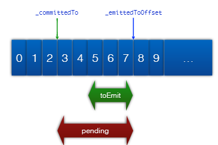

# Storm Kafka Integration


## 一、Storm-Kafka 小例子


初始化KafkaSpout

```java
private static final String BROKER_HOSTS_STR = "localhost:2181";

private static final String TOPIC = "topic-storm";
private static final String ZK_ROOT = "/kafkaspout-demo";

private static final String TOPIC_RESULT = "topic-storm-result";

/**
 * 初始化kafkaSpout.
 */
protected static KafkaSpout initKafkaSpout() {


  BrokerHosts brokerHosts = new ZkHosts(BROKER_HOSTS_STR);
  SpoutConfig spoutConfig = new SpoutConfig(brokerHosts, TOPIC, ZK_ROOT, UUID.randomUUID().toString());
  spoutConfig.scheme = new SchemeAsMultiScheme(new StringScheme());
  
  // 一定要设置, 尤其是LocalCluster模式下
  spoutConfig.zkServers = Arrays.asList(new String[] {"localhost"});
  spoutConfig.zkPort = 2181;

  return new KafkaSpout(spoutConfig);
}
```


初始化KafkaBolt

- 设置producer的基本属性
- 设置withTopicSelector，指定写入的topic
- 设置 withTupleToKafkaMapper，将Tuple转换成kafka存储对应的消息

```java
protected static KafkaBolt initKafkaBolt() {

  // 设置producer属性
  Properties props = new Properties();
  props.put("bootstrap.servers", "localhost:9092");
  props.put("acks", "1");
  props.put("key.serializer", "org.apache.kafka.common.serialization.StringSerializer");
  props.put("value.serializer", "org.apache.kafka.common.serialization.StringSerializer");

  KafkaBolt kafkaBolt = new KafkaBolt()
                .withProducerProperties(props)
                .withTopicSelector(new DefaultTopicSelector(TOPIC_RESULT))
                .withTupleToKafkaMapper(new FieldNameBasedTupleToKafkaMapper<>());

  return kafkaBolt;
}
```


详情见代码: https://github.com/harryyu1018/workshop-for-storm/blob/master/word-count/src/main/java/top/yujy/wordcount/KafkaSpoutTopology.java


## 二、KafkaConfig


```java
public KafkaConfig(BrokerHosts hosts, String topic);
public KafkaConfig(BrokerHosts hosts, String topic, String clientId);
```


### SpoutConfig

SpoutConfig是KafkaConfig的一个子类。它提供了额外的字段用于存储：zk的连接信息和 for controlling behavior specific to KafkaSpout。

```java
public SpoutConfig(BrokerHosts hosts, String topic, String zkRoot, String id);
public SpoutConfig(BrokerHosts hosts, String topic, String id);
```

设置多久将Kafka消费offset存储到ZK中

```java
// setting for how often to save the current Kafka offset to ZooKeeper
public long stateUpdateIntervalMs = 2000;
```


KafkaConfig 还有其他一组控制应用表现的变量

```java
public int fetchSizeBytes = 1024 * 1024;
public int socketTimeoutMs = 10000;
public int fetchMaxWait = 10000;
public int bufferSizeBytes = 1024 * 1024;
public MultiScheme scheme = new RawMultiScheme();
public boolean ignoreZkOffsets = false;
public long startOffsetTime = kafka.api.OffsetRequest.EarliestTime();
public long maxOffsetBehind = Long.MAX_VALUE;
public boolean useStartOffsetTimeIfOffsetOutOfRange = true;
public int metricsTimeBucketSizeInSecs = 60;
```


### MultiScheme

MultiScheme是一个接口，用于描述ByteBuffer如何从Kafka消费，再转换成Storm Tuple。它同时控制应用输出字段的命名(controls the naming of your output field)。

```java
public Iterable<List<Object>> deserialize(ByteBuffer ser);
public Fields getOutputFields();
```


**实现类**

- **RawMultiScheme**:	  获取一个ByteBuffer & 返回一个byte[] (ByteBuffer转换后) tuple。输出字段outputField的名字为"bytes"。

 **RawMultiScheme**:  获取一个ByteBuffer & 返回一个byte[] (ByteBuffer转换后) tuple。输出字段outputField的名字为"bytes"。

- **SchemeAsMultiScheme**
- **KeyValueSchemeAsMultiScheme**
- **SchemeAsMultiScheme**
- **MessageMetadataSchemeAsMultiScheme**

```java
public Iterable<List<Object>> deserializeMessageWithMetadata(ByteBuffer message, Partition partition, long offset);
```

PS: 保存每个消息的分区和消费点位替代持久化整个消息，这种方法对于从任意消费点位审计和重播Kafka topic中的消息是非常有用的。

This is useful for auditing/replaying messages from arbitrary points on a Kafka topic, saving the partition and offset of each message of a discrete stream instead of persisting the entire message.


### Failed message retry

FailedMsgRetryManager是一个定义失败消息重试策略的接口。默认实现是ExponentialBackoffMsgRetryManager，连续重试之间的间隔按照指数增长。如果需要自定义实现，那么设置`SpoutConfig.failedMsgRetryManagerClass = <自定义策略实现类的全名fullClassName>`。


> **版本不兼容**
>
> In Storm versions prior to 1.0, the MultiScheme methods accepted a `byte[]` instead of `ByteBuffer`. The `MultScheme` and the related Scheme apis were changed in version 1.0 to accept a ByteBuffer instead of a byte[].
>
> This means that pre 1.0 kafka spouts will not work with Storm versions 1.0 and higher. While running topologies in Storm version 1.0 and higher, it must be ensured that the storm-kafka version is at least 1.0. Pre 1.0 shaded topology jars that bundles storm-kafka classes must be rebuilt with storm-kafka version 1.0 for running in clusters with storm 1.0 and higher.


### Examples

**Core Spout**

```java
BrokerHosts hosts = new ZKHosts(zkConnString);
SpoutConfig spoutConfig = new SpoutConfig(hosts, topicName, "/" + topicName, UUID.randomUUID().toString());

spoutConfig.scheme = new SchemeAsMultiScheme(new StringScheme());
KafkaSpout kafkaSpout = new KafkaSpout(spoutConfig);
```

**Trident Spout**

```java
TridentTopology topology = new TridentTopology();

BrokerHosts zk = new ZKHosts("localhost");
TridentKafkaConfig spoutConf = new TridentKafkaConfig(zk, "test-topic");

spoutConfig.scheme = new SchemeAsMultiScheme(new StringScheme());
OpaqueTridentKafkaSpout spout = new OpaqueTridentKafkaSpout(spoutConf);
```


### KafkaSpout如何存储消费点位&在失败的情况下恢复？

可以通过设置`kafkaConfig.startOffsetTime`来控制Spout从Topic中开始读取的位置，有如下三种方法：

1. `kafka.api.OffsetRequest.EarliestTime` : 从topic的开头开始读取（最老的一条信息）
2. `kafka.api.OffsetRequest.LatestTime()` : 从topic的最后一条开始读取（任何写入topic的新消息）
3. Unix时间戳( System.currentTimeMills() )，see [How do I accurately get offsets of messages for a certain timestamp using OffsetRequest? ](https://cwiki.apache.org/confluence/display/KAFKA/FAQ#FAQ-HowdoIaccuratelygetoffsetsofmessagesforacertaintimestampusingOffsetRequest?) in Kafka FAQ


Topology运行中Kafka spout会记录其已经读取和发出（emit）的消息点位（offset）, 并存储这些状态信息在ZK的 `SpoutConfig.zkRoot + "/" + SpoutConfig.id`节点中。当出现失败，Topology会读取上次写入offset进行恢复。

> PS: 当重新部署Topology时需要保证SpoutConfig.zkRoot & SpoutConfig.id两个值没有被修改，否则spout将不能从ZK读取上次消费状态信息(offset)。这有可能导致未知的情况，造成


This means that when a topology has run once the setting `KafkaConfig.startOffsetTime` will not have an effect for subsequent runs of the topology because now the topology will rely on the consumer state information (offsets) in ZooKeeper to determine from where it should begin (more precisely: resume) reading.

 If you want to force the spout to ignore any consumer state information stored in ZooKeeper, then you should set the parameter `KafkaConfig.ignoreZkOffsets` to `true`. If `true`, the spout will always begin reading from the offset defined by `KafkaConfig.startOffsetTime` as described above.


## 三、KafkaSpout浅析

**原理**

- kafka topic的partition均匀分配给spout task
- 每个spout task负责消费1个或多个partition
- nextTuple()从kafka取数据，emit tuple
- ack()标记已处理的tuple，用来更新消费的offset，消费过的offset就不再重复了
- fail()标记未处理完的tuple，用来重新从kafka取到未处理完的数据进行消费


### Partition 分配策略

1. 在KafkaSpout中获取spout的task的个数，对应的就是consumer的个数，如下:

```java
int totalTasks = context.getComponentTasks(context.getThisComponentId()).size();
```


2. 获取partition与leader partition所在broker的映射关系


2.1	kafkaSpout 创建实际消费Partition的Consumer包装对象DynamicPartitionConnections。其内部会创建SimpleConsumer对象用于消费partition。

```java
// DynamicPartitionConnections _connections;
_connections = new DynamicPartitionConnections(_spoutConfig, KafkaUtils.makeBrokerReader(conf, _spoutConfig));
```


2.2 	**ZkBrokerReader** 创建时会同时创建用于动态读取Broker信息的DynamicBrokersReader对象，并且获得拉取数据源topic中partition和对应leader映射关系的Map结构（最后获得List<GlobalPartitionInformation>对象）。

```java
public ZkBrokerReader(Map conf, String topic, ZkHosts hosts) {
  try {
    // 创建动态读取Broker信息的Reader对象
    reader = new DynamicBrokersReader(conf, hosts.brokerZkStr, hosts.brokerZkPath, topic);
    
    // 实际执行读取Broker信息，并cache住partition和其leader信息
    cachedBrokers = reader.getBrokerInfo();
    
    // 上次刷新时间 & 刷新时间间隔，用于动态定时更新broker信息
    lastRefreshTimeMs = System.currentTimeMillis();
    refreshMillis = hosts.refreshFreqSecs * 1000L;
  
  } catch (java.net.SocketTimeoutException e) {
    LOG.warn("Failed to update brokers", e);
  }

}
```


2.3	**DynamicBrokersReader** 中的getBrokerInfo方法读取topic对应每个partition的leader节点（broker id）

```java
public List<GlobalPartitionInformation> getBrokerInfo() throws SocketTimeoutException {
  	  // 读取spout指定的topic
  List<String> topics =  getTopics();
  List<GlobalPartitionInformation> partitions =  new ArrayList<GlobalPartitionInformation>();

  for (String topic : topics) {
    GlobalPartitionInformation globalPartitionInformation = new GlobalPartitionInformation(topic, this._isWildcardTopic);
    
    try {
      // 获取topic的所有分区总数
      // '/brokers/topics/[topicName]/partitions'
      // 子节点: [0, 1] --> partition ids
      int numPartitionsForTopic = getNumPartitions(topic);
      
      // 读取kafka上对应broker的路径
      // '/brokers/ids'
      // [0, 1] --> broker ids
      String brokerInfoPath = brokerPath();
      
      // 遍历所有分区
      for (int partition = 0; partition < numPartitionsForTopic; partition++) {
        
        // 获取对应分区的leader（broker id）
        // '/brokers/topics/[topicName]/partitions/[partitionId]/state'
        // 节点中的值: {"controller_epoch":1,"leader":0,"version":1,"leader_epoch":0,"isr":[0]}
        int leader = getLeaderFor(topic,partition);
        
        // '/brokers/ids/[brokerId]'
        String path = brokerInfoPath + "/" + leader;
        
        try {
          // 读取leader broker信息, 并以 <partitionId, Broker对象>kv存储
          byte[] brokerData = _curator.getData().forPath(path);
          Broker hp = getBrokerHost(brokerData);
          globalPartitionInformation.addPartition(partition, hp);
        
        } catch (org.apache.zookeeper.KeeperException.NoNodeException e) {
          LOG.error("Node {} does not exist ", path);
        }
      }
    
    } catch (SocketTimeoutException e) {
      throw e;
    } catch (Exception e) {
      throw new RuntimeException(e);
    }
    
    LOG.info("Read partition info from zookeeper: " + globalPartitionInformation);
    partitions.add(globalPartitionInformation);
  
  }
  return partitions;
}
```


简单说一下GlobalPartitionInformation，这个类主要存储的是某一个topic，topic包含分区和对应Leader Broker的映射Map结构，代码如下：

```java
public class GlobalPartitionInformation implements Iterable<Partition>, Serializable {
  private Map<Integer, Broker> partitionMap;
  public String topic;
  
  // something ...
}
```


3.	在KafkaSpout中获取当前spout的 task index。需要注意，task index 和 task id是不同的，task id是当前spout在整个topology中的id，而 task index 是当前spout在组件中的id，取值范围为[0, spout_task_number - 1]，代码如下：

```java
// PartitionCoordinator _coordinator;
_coordinator = new ZkCoordinator(_connections, conf, _spoutConfig, _state, context.getThisTaskIndex(), totalTasks, topologyInstanceId);
```


接口实现结构：

PartitionCoordinator

- ZkCoordinator
- StaticCoordinator


4. 获取当前spout的task消费的partition

```java
public static List<Partition> calculatePartitionsForTask(List<GlobalPartitionInformation> partitons, int totalTasks, int taskIndex) {
  
  Preconditions.checkArgument(taskIndex < totalTasks, "task index must be less that total tasks");
  
  List<Partition> taskPartitions = new ArrayList<Partition>();
  List<Partition> partitions = new ArrayList<Partition>();
  
  // 获取排序后的partition集合
  for(GlobalPartitionInformation partitionInformation : partitons) {
    partitions.addAll(partitionInformation.getOrderedPartitions());
  }
  
  // 如果spout的task个数多余partition，那么有的task将会standby
  int numPartitions = partitions.size();
  if (numPartitions < totalTasks) {
    LOG.warn("there are more tasks than partitions (tasks: " + totalTasks + "; partitions: " + numPartitions + "), some tasks will be idle");
  }
  
  // 核心部分
  // 每个task按照index的顺序依次获取指定下标号的partition
  // 假设spout的并发度是3，当前spout的task index 是 1，总的partition的个数为5，那么当前spout消费的partition id为1,4
  for (int i = taskIndex; i < numPartitions; i += totalTasks) {
    Partition taskPartition = partitions.get(i);
    taskPartitions.add(taskPartition);
  }
  
  logPartitionMapping(totalTasks, taskIndex, taskPartitions);
  return taskPartitions;

}

```


### Partition 更新策略

如果出现spout task挂掉，或者broker宕机，那么spout是要重新分配partition的。KafkaSpout的设计中并没有监听ZK上的broker节点、partition节点和其他spout的状态，所以当有异常情况出现时KafkaSpout并不知道。为了解决这个问题，其采用了两种方法来更新partition的分配。


1. 定时更新

根据ZKHosts中的refreshFreqSecs字段来设置定时更新partition列表，可以通过修改配置来更改定时刷新的间隔（实际上最终是传递给`ZkCoordinator的_refreshFreqMs`）。每一次调用KafkaSpout的nextTuple方法时，都会首先调用 **ZkCoordinator** 的 **getMyManagedPartitions**  方法来获取当前spout消费的partition列表。


**ZkCoordinator**

```java
@Override
public List<PartitionManager> getMyManagedPartitions() {
  // 首次启动 or 达到更新间隔
  if (_lastRefreshTime == null || (System.currentTimeMillis() - _lastRefreshTime) > _refreshFreqMs) {
    
    // 实际更新方法
    refresh();
    _lastRefreshTime = System.currentTimeMillis();
  }
  
  // List<PartitionManager> _cachedList = new ArrayList<PartitionManager>();
  // spout中实际消费数据最终都委托给PartitionManager
  return _cachedList;

}
```


2. 异常更新

当调用KafkaSpout的nextTuple方法出现异常时，强制更新当前spout task的partition消费列表


### KafkaSpout获取每条Tuple的原理


**nextTuple()获取Tuple流程**

1. 从_coordinate中获取负责的分区列表PartitionManager
2. 遍历分区列表，依次调用其next方法发送Tuple
3. 委托给PartitionManager的next方法进行操作Tuple
4. ​


```java
@Override
public void nextTuple() {
  // 获取该spout task所有负责的partition对应的PartitionManager
  List<PartitionManager> managers = _coordinator.getMyManagedPartitions();
  
  for (int i = 0; i < managers.size(); i++) { 
    try {
      // 获取本次操作的Partition Index(managers中的下标号)
      // mod是为了防止越界
      _currPartitionIndex = _currPartitionIndex % managers.size();
      
      // 实际委托给PartitionManager的next方法进行操作Tuple
      // 返回Emit的状态，有三种: EMITTED_MORE_LEFT, EMITTED_END, NO_EMITTED
      EmitState state = managers.get(_currPartitionIndex).next(_collector);
      
      // 如果当前分区没有消息了,轮询到下一个
      if (state != EmitState.EMITTED_MORE_LEFT) {
        _currPartitionIndex = (_currPartitionIndex + 1) % managers.size();
      }
      if (state != EmitState.NO_EMITTED) {
        break;
      }
    } catch (FailedFetchException e) {
      LOG.warn("Fetch failed", e);
      _coordinator.refresh();
    }
  }

  // 确定commit到ZK的时间周期，到达周期就触发提交
  long diffWithNow = System.currentTimeMillis() - _lastUpdateMs;

  /*
  	As far as the System.currentTimeMillis() is dependent on System clock,
  	additional check on negative value of diffWithNow in case of external changes.
  	*/
  if (diffWithNow > _spoutConfig.stateUpdateIntervalMs || diffWithNow < 0) {
    commit();
  }
}
```


```java
// ack
@Override
public void ack(Object msgId) {
  KafkaMessageId id = (KafkaMessageId) msgId;
  PartitionManager m = _coordinator.getManager(id.partition);
  if (m != null) {
    m.ack(id.offset);
  }
}

// fail
@Override
public void fail(Object msgId) {
  KafkaMessageId id = (KafkaMessageId) msgId;
  PartitionManager m = _coordinator.getManager(id.partition);
  if (m != null) {
    m.fail(id.offset);
  }
}


// commit
private void commit() {
  _lastUpdateMs = System.currentTimeMillis();
  for (PartitionManager manager : _coordinator.getMyManagedPartitions()) {
    manager.commit();
  }
}
```


**KafkaMessageId**

```java
static class KafkaMessageId implements Serializable {
  
  // org.apache.storm.kafka.Partition (注意不是Kafka里面的Partition)
  public Partition partition;
  public long offset;
  
  // here is constructor
}
```


### PartitionManager分析

**Emit的三种状态**

```java
static enum EmitState {
  EMITTED_MORE_LEFT, EMITTED_END, NO_EMITTED
}
```

**next()函数**

```java
public EmitState next(SpoutOutputCollector collector) {
  
  // 如果等待emit队列已空
  // 则再次从Partition中拉取数据
  if (_waitingToEmit.isEmpty()) {
    fill();
  }
  
  while (true) {
    // 从等待emit队列取出第一条
    // 如果没有消息，说明对应的partition当前已经没有数据了,返回 NO_EMITED 状态
    MessageAndOffset toEmit = _waitingToEmit.pollFirst();
    if (toEmit == null) {
      return EmitState.NO_EMITTED;
    }

    // 根据Scheme反序列化得到消息(tuple集合)
    Iterable<List<Object>> tups;
    if (_spoutConfig.scheme instanceof MessageMetadataSchemeAsMultiScheme) {
      tups = KafkaUtils.generateTuples((MessageMetadataSchemeAsMultiScheme) _spoutConfig.scheme, toEmit.message(), _partition, toEmit.offset());
    } else {
      tups = KafkaUtils.generateTuples(_spoutConfig, toEmit.message(), _partition.topic);
    }
            
    // 如果当前消息反序列化的tuple集合不为空，那么使用collector发送消息
    if ((tups != null) && tups.iterator().hasNext()) {
      if (!Strings.isNullOrEmpty(_spoutConfig.outputStreamId)) {
        
        for (List<Object> tup : tups) {
          collector.emit(_spoutConfig.topic, tup, new KafkaMessageId(_partition, toEmit.offset()));
        }
      } else {
        
        for (List<Object> tup : tups) {
          collector.emit(tup, new KafkaMessageId(_partition, toEmit.offset()));
        }
      }
      
      // 跳出
      break;
    
    } else {
      // 如果该条消息反序列化后为空，则直接ack当前offset，并继续处理下一条，直至
      // 反序列化结果不为空
      ack(toEmit.offset());
    }
  }
  
  // 处理完一条消息后，如果等待emit队列不为空，则返回 EMITTED_MORE_LEFT 状态
  if (!_waitingToEmit.isEmpty()) {
    return EmitState.EMITTED_MORE_LEFT;
  } else {
    return EmitState.EMITTED_END;
  }
}
```


#### KafkaSpout流程示意

 




- emittedToOffset: 已经从kafka读到的最大offset
- committedTo: 已经确认处理完的最大offset
- pending: 已经从kafka读到，但是还没有ack的offset队列
- waitingToEmit: 已从kafka读到，但是还没有emit出去的数据


#### 定时commit

```java
public long lastCompletedOffset() {
  if (_pending.isEmpty()) {
    return _emittedToOffset;
  } else {
    return _pending.firstKey();
  }
}

public void commit() {
  
  // 当前完成的最新进度
  long lastCompletedOffset = lastCompletedOffset();
  
  // _committedTo 上次提交到 ZK中的消费进度 offset, 不相等则不进行commit
  if (_committedTo != lastCompletedOffset) {
    
    LOG.debug("Writing last completed offset ({}) to ZK for {} for topology: {}", lastCompletedOffset, _partition, _topologyInstanceId);
    
    // 存储消费情况的json数据
    Map<Object, Object> data = (Map<Object, Object>) ImmutableMap.builder()
                    .put("topology", ImmutableMap.of("id", _topologyInstanceId,
                            "name", _stormConf.get(Config.TOPOLOGY_NAME)))
                    .put("offset", lastCompletedOffset)
                    .put("partition", _partition.partition)
                    .put("broker", ImmutableMap.of("host", _partition.host.host,
                            "port", _partition.host.port))
                    .put("topic", _partition.topic).build();
    
    _state.writeJSON(committedPath(), data);

    // 更新上次提交的消费点位offset
    _committedTo = lastCompletedOffset;
    
    LOG.debug("Wrote last completed offset ({}) to ZK for {} for topology: {}", lastCompletedOffset, _partition, _topologyInstanceId);
  
  } else {
    LOG.debug("No new offset for {} for topology: {}", _partition, _topologyInstanceId);
  }
}
```


**commit内容**

```json
{
  "topology": {
    "id": "kafka-spout-demo-1-1489642910",
    "name": "kafka-spout-demo"
  },
  "offset": 2,
  "partition": 0,
  "broker": {
    "host": "ZB-PC0DD5WG.360buyAD.local",
    "port": 9092
  },
  "topic": "topic-storm"
}
```


## KafkaBolt分析

**关键参数：**

- TopicSelector: 数据写到哪个topic
- TupleToKafkaMapper: 从Storm的tuple选择哪些字段写Kafka
- serializer class: 把选择的字段转成kafka的byte[]
- broker list: broker列表


**原理：**

- TopicSelector决定写入哪个topic
  - DefaultTopicSelector可以指定固定的topic
- TupleToKafkaMapper决定写入tuple中的哪些数据
  - FieldNameBasedTupleToKafkaMapper 默认取tuple中的“key”字段为partition key，“message”字段作为待写入的对象，**字段名可定制**
- serilaiizer class决定怎么序列化要写入kafka的对象
  - StringEncoder把String对象序列化成byte[]
- kafka producer相关的其他配置


```java
@Override
public void prepare(Map stormConf, TopologyContext context, OutputCollector collector) {
  //for backward compatibility.
  if(mapper == null) {
    this.mapper = new FieldNameBasedTupleToKafkaMapper<K,V>();
  }

  //for backward compatibility.
  if(topicSelector == null) {
    this.topicSelector = new DefaultTopicSelector((String) stormConf.get(TOPIC));
  }

  producer = new KafkaProducer<>(boltSpecfiedProperties);
  this.collector = collector;
}
```


