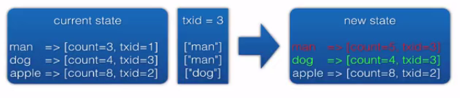

# Trident


## Trident 基础


### Trident是什么

1. Trident是Storm基础上封装的高级框架

- 集成常用操作如filter, function, group, aggregation, join
- 支持不丢不重（exactly once）
- 支持**有状态的流式处理**，可以对接各种存储系统
- 集成DRPC查询状态


2. 比原生Storm API更简单应用

- 提供了高层操作，如filter, group, join等
- 封装了复杂的有状态，不丢不重流式处理
- 封装了复杂的流式处理


3. 兼顾流式处理的低延迟和批处理的高吞吐

- 默认做了微批处理，批量读写存储优化
- 分批大小可以灵活控制，延迟仍然可控
- 自动对操作进行组合优化，避免不必要的网络传输


4. 是一个可扩展的框架

- 可以增加自己的高层处理函数实现业务逻辑
- 可以实现与已有存储系统对接的有状态处理
- 可以根据需要选择不同界别的容错：at most once / at least once / exactly once


### Trident 用法


#### 基本概念

> TridentStream

- Stream由一系列TridentTuple batch组成
- Stream分partition，一个task一个Partition
- 在Stream上进行操作产生新的Stream/State，就构成了一个TridentTopology
  - Partition Local Operation: Project, Function, Filter, partitionAggregate, partitionPersist
  - Aggregation Operation: aggregate, partitionAggregate
  - Group Operation: groupBy
  - Join: merge, join


> TridentState

- 封装了状态处理，对接不同存储系统
- 幂等的状态更新操作，支持exactly once语义


流式数据处理

- 调用newStream基于spout创建初始Stream
- 调用各种操作如filter, group进行Stream交换
- 调用persist*接口存储要保存的状态


调用DRPC查询状态

- 调用newDRPCStream创建DRPC请求Stream
- 调用stateQuery读取之前保存的状态


### Trident Examples


#### Word Count for Trident 的实现

**构建Trident Topology**

- 生成固定批处理大小的Spout
- 构建流处理的Trident State
- 构建用于查询state的Trident DRPC流


```java
private static final int MAX_BATCH_SIZE = 3;
private static final Values[] dataset = {
    new Values("the cow jumped over the moon"),
    new Values("the man went to the store and bought some candy"),
    new Values("four score and seven years ago"),
    new Values("how many apples can you eat"),
    new Values("to be or not to be the person")
};

public static StormTopology buildTopology(LocalDRPC drpc) {
  // 生成固定批处理大小的Spout
  FixedBatchSpout spout = new FixedBatchSpout(new Fields("sentence"), MAX_BATCH_SIZE, dataset);
  spout.setCycle(true);

  TridentTopology topology = new TridentTopology();
  TridentState state = topology.newStream("spout1", spout).parallelismHint(16)
                .each(new Fields("sentence"), new Split(), new Fields("word"))
                .groupBy(new Fields("word"))
                .persistentAggregate(new MemoryMapState.Factory(), new Count(), new Fields("count")).parallelismHint(16);

  topology.newDRPCStream("words", drpc)
                .each(new Fields("args"), new Split(), new Fields("word"))
                .groupBy(new Fields("word"))
                .stateQuery(state, new Fields("word"), new MapGet(), new Fields("count"))
                .each(new Fields("count"), new FilterNull())
                .aggregate(new Fields("count"), new Sum(), new Fields("sum"));

  return topology.build();
}
```

**分词方法Split**

- 方法继承BaseFunction(org.apache.storm.trident.operation)
- 在execute里面编写对应的实现

```java
public static class Split extends BaseFunction {

  @Override
  public void execute(TridentTuple tuple, TridentCollector collector) {
    String sentence = tuple.getString(0);
    for (String word : sentence.split(" ")) {
      collector.emit(new Values(word));
    }
}
```

**求和方法Count（Trident内置）**

```java
// package org.apache.storm.trident.operation.builtin;

public class Count implements CombinerAggregator<Long> {

    @Override
    public Long init(TridentTuple tuple) {
        return 1L;
    }

    @Override
    public Long combine(Long val1, Long val2) {
        return val1 + val2;
    }

    @Override
    public Long zero() {
        return 0L;
    }
    
}
```


#### 将结果存入外部存储—Redis为例

参考`top.yujy.wordcount.TridentWordCountAndStoreIntoRedis`实现

```java
// 定义Redis的信息
JedisPoolConfig jedisPoolConfig = new JedisPoolConfig.Builder()
                .setHost("localhost").setPort(6379).build();

// 使用Redis Hash 进行存储
RedisDataTypeDescription typeDescription = new RedisDataTypeDescription(RedisDataTypeDescription.RedisDataType.HASH, "wc");

TridentTopology topology = new TridentTopology();
TridentState state = topology.newStream("spout1", spout).parallelismHint(16)
  .each(new Fields("sentence"), new Split(), new Fields("word"))
  .groupBy(new Fields("word"))
  .persistentAggregate(
  	// 这个地方使用RedisMapState 取代 内存存储 MemoryMapState
  	// 注意一定要使用RedisMapState, 如果使用RedisState会报错
  	RedisMapState.transactional(jedisPoolConfig, typeDescription), 
  	new Count(), 
  	new Fields("count"))
  .parallelismHint(16);
```


#### 对比裸写Storm程序

- 代码更简洁直观、易懂、看到的是操作而不是接口
- 堆积木式的编程方式，像函数式语言
- 复杂操作调用接口就可以了
- 生成结果和DRPC查询结果很好结合


## Trident 进阶


### State

实时计算的一个关键问题就在于**如何管理状态（state）**，使得在失败与重试操作之后的更新过程仍然是幂等的。误是不可消除的，所以在出现节点故障或者其他问题发生时批处理操作还需要进行重试。不过这里最大的问题就在于怎样执行一种合适的状态更新操作（不管是针对外部数据库还是拓扑内部的状态），来使得每个消息都能够被执行且仅仅被执行一次。

这个问题很麻烦，接下来的例子里面就有这样的问题。假如你正在对你的数据流做一个计数聚合操作，并且打算将计数结果存储到一个数据库中。如果你只在数据库中存储了计数结果，那么在你继续准备更新某个块的状态的时候，你没法知道到底这个状态有没有被更新过。这个数据块有可能在更新数据库的步骤上成功了，但在后续的步骤中失败了，也有可能先失败了，没有进行更新数据库的操作。你完全不知道到底发生了什么。

Trident 通过下面两件事情解决了这个问题：

1. 在 Trident 中为每个数据块标记了一个唯一的 id，这个 id 就叫做“事务 id”（transaction id）。如果数据块由于失败回滚了，那么它持有的事务 id 不会改变。
2. State 的更新操作是按照数据块的顺序进行的。也就是说，在成功执行完块 2 的更新操作之前，不会执行块 3 的更新操作。


基于这两个基础特性，你的 state 更新就可以实现恰好一次（exactly-once）的语义。与仅仅向数据库中存储计数不同，这里你可以以一个原子操作的形式把事务 id 和计数值一起存入数据库。在后续更新这个计数值的时候你就可以先比对这个数据块的事务 id。如果比对结果是相同的，那么就可以跳过更新操作 —— 由于 state 的强有序性，可以确定数据库中已经包含有当前数据库的额值。而如果比对结果不同，就可以放心地更新计数值了。


当然，你不需要在拓扑中手动进行这个操作，操作逻辑已经在 State 中封装好了，这个过程会自动进行。同样的，你的 State 对象也不一定要实现事务 id 标记：如果你不想在数据库里耗费空间存储事务 id，你就不用那么做。在这样的情况下，State 会在出现失败的情形下保持“至少处理一次”的操作语义（这样对你的应用也是一件好事）。在[这篇文章](http://ifeve.com/storm-trident-state)里你可以了解到更多关于如何实现 State 以及各种容错性权衡技术。


你可以使用任何一种你想要的方法来实现 state 的存储操作。你可以把 state 存入外部数据库，也可以保存在内存中然后在存入 HDFS 中（有点像 HBase 的工作机制）。State 也并不需要一直保存某个状态值。比如，你可以实现一个只保存过去几个小时数据并将其余的数据删除的 State。这是一个实现 State 的例子：[Memcached integration](https://github.com/nathanmarz/trident-memcached/blob/master/src/jvm/trident/memcached/MemcachedState.java)。


### Trident 拓扑运行

Trident 拓扑会被编译成一种尽可能和普通拓扑有着同样的运行效率的形式。只有在请求数据的重新分配（比如 groupBy 或者 shuffle 操作）时 tuple 才会被发送到网络中。因此，像下面这样的 Trident 拓扑：


它会被编译成如下的Storm Topology


## Trident 原理

- 怎么做到不丢不重
- 怎么维护状态
- 怎么集成DRPC查询状态
- 怎么封装常用操作


### 如何实现不丢不重

- 什么时候会丢？
  - tuple fail后，如果不replay就可能会丢
  - 因为有些bolt还没有处理这个tuple
- 什么时候会重？
  - tuple fail后，如果replay就可能重复
  - 因为有些bolt已经处理过这个tuple


> 思考

- 不丢很好解决，spout replay就可以
- 不丢且不重不容易做到
  - 每个tuple/batch给个ID
  - 处理tuple/batch时判断这个ID是否处理过，忽略已经处理过的tuple/batch
  - 隐含条件
    - spout replay tuple/batch时ID要保持和之前fail的一致
    - 有地方存处理过的ID，还要有清理机制


> Trident的方案

- 对tuple进行小批batch处理
- 每个batch一个唯一txid，replay时txid保持不变（TridentSpout自动做好上面两点）
- 区分无状态操作和状态更新操作，对状态更新操作按照batch txid严格有序执行
  - 因此只用保存最后处理过的txid即可做去重





###  怎么维护状态

- 状态值和txid组合成一个JSON串，原子更新
- State框架内部做好根据txid去重的逻辑
- State框架调用对应用存储系统具体实现的接口如multiGet/multiPut更新状态
- State框架内部提供cache、批处理等性能优化


### 怎么集成DRPC查询状态

从DRPCSpout生成一个Stream + 普通操作

- 在这个Stream上进行各种操作实现逻辑
- 调用stateQuery查询State中的状态数据
- 对返回的状态Stream继续做后续操作


### 怎么封装常用操作

- 每个操作对应一个TridentOperator和TridentTopology中的一个Node
  - ProjectedProcessor, EachProcessor, AggregateProcessor, PartitionPersistProcessor, StateQueryProcessor
  - SpoutNode, ProcessorNode, PartitionNode
- partition local的一个或多个TridentOperator组成一个Bolt
- 每个repartition操作对应一次StreamGrouping，产生新的Bolt
- 最终生成一个普通的StormTopology


